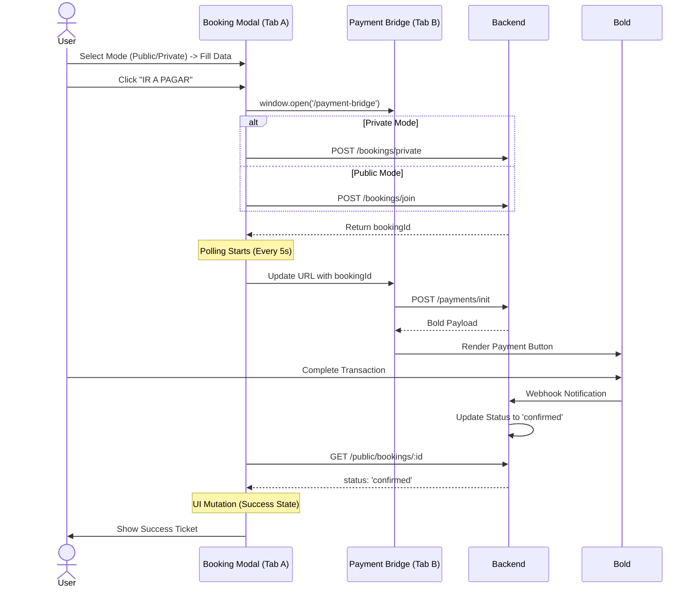

# 🔄 System Flows

## 1. Booking & Payment Sequence (Multi-Mode Bridge Pattern)

```mermaid
sequenceDiagram
    actor User
    participant MainTab as Booking Modal (Tab A)
    participant Bridge as Payment Bridge (Tab B)
    participant Backend
    participant Bold

    User->>MainTab: Select Mode (Public/Private) -> Fill Data
    User->>MainTab: Click "IR A PAGAR"
    
    MainTab->>Bridge: window.open('/payment-bridge')
    
    alt Private Mode
        MainTab->>Backend: POST /bookings/private
    else Public Mode
        MainTab->>Backend: POST /bookings/join
    end
    
    Backend-->>MainTab: Return bookingId
    Note over MainTab: Polling Starts (Every 5s)
    
    MainTab->>Bridge: Update URL with bookingId
    Bridge->>Backend: POST /payments/init
    Backend-->>Bridge: Bold Payload
    Bridge->>Bold: Render Payment Button
    
    User->>Bold: Complete Transaction
    Bold->>Backend: Webhook Notification
    
    Backend->>Backend: Update Status to 'confirmed'
    
    MainTab->>Backend: GET /public/bookings/:id
    Backend-->>MainTab: status: 'confirmed'
    
    Note over MainTab: UI Mutation (Success State)
    MainTab->>User: Show Success Ticket
```