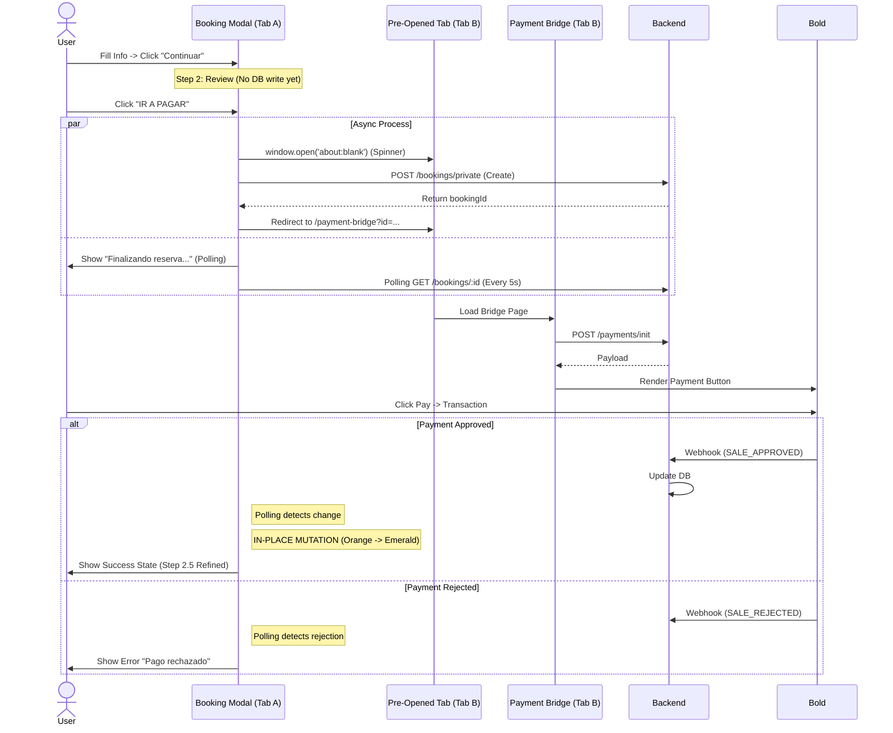

# 🔄 System Flows

## 1. Booking & Payment Sequence (Just-in-Time Pattern)

```mermaid
sequenceDiagram
    actor User
    participant MainTab as Booking Modal (Tab A)
    participant PreTab as Pre-Opened Tab (Tab B)
    participant Bridge as Payment Bridge (Tab B)
    participant Backend
    participant Bold

    User->>MainTab: Fill Info -> Click "Continuar"
    Note over MainTab: Step 2: Review (No DB write yet)
    
    User->>MainTab: Click "IR A PAGAR"
    
    par Async Process
        MainTab->>PreTab: window.open('about:blank') (Spinner)
        MainTab->>Backend: POST /bookings/private (Create)
        Backend-->>MainTab: Return bookingId
        
        MainTab->>PreTab: Redirect to /payment-bridge?id=...
    and
        MainTab->>User: Show "Finalizando reserva..." (Polling)
        MainTab->>Backend: Polling GET /bookings/:id (Every 5s)
    end
    
    PreTab->>Bridge: Load Bridge Page
    Bridge->>Backend: POST /payments/init
    Backend-->>Bridge: Payload
    Bridge->>Bold: Render Payment Button
    
    User->>Bold: Click Pay -> Transaction
    
    alt Payment Approved
        Bold->>Backend: Webhook (SALE_APPROVED)
        Backend->>Backend: Update DB
        
        Note right of MainTab: Polling detects change
        Note right of MainTab: IN-PLACE MUTATION (Orange -> Emerald)
        MainTab->>User: Show Success State (Step 2.5 Refined)
    else Payment Rejected
        Bold->>Backend: Webhook (SALE_REJECTED)
        
        Note right of MainTab: Polling detects rejection
        MainTab->>User: Show Error "Pago rechazado"
    end
```
