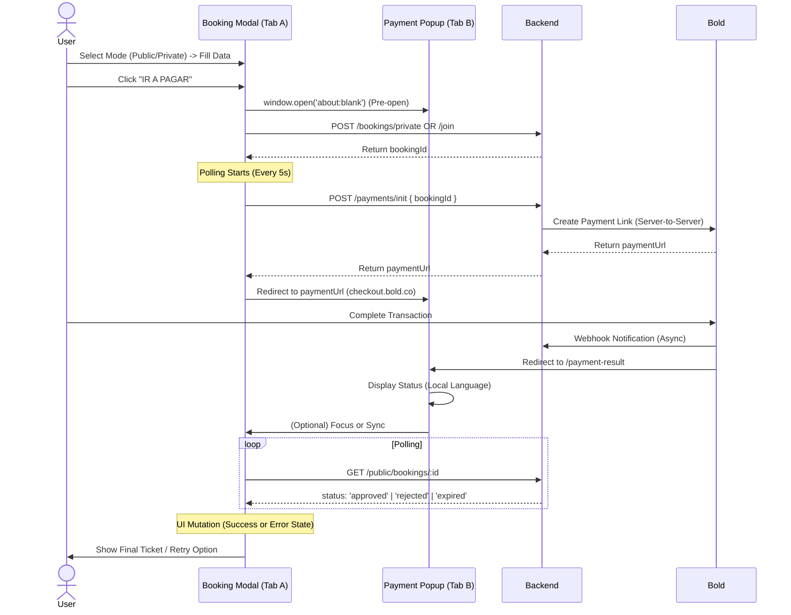

# 🔄 System Flows

## 1. Booking & Payment Sequence (Smart Link Pattern v2.7.5)

```mermaid
sequenceDiagram
    actor User
    participant MainTab as Booking Modal (Tab A)
    participant Popup as Payment Popup (Tab B)
    participant Backend
    participant Bold

    User->>MainTab: Select Mode (Public/Private) -> Fill Data
    User->>MainTab: Click "IR A PAGAR"
    
    MainTab->>Popup: window.open('about:blank') (Pre-open)
    MainTab->>Backend: POST /bookings/private OR /join
    Backend-->>MainTab: Return bookingId
    
    Note over MainTab: Polling Starts (Every 5s)
    
    MainTab->>Backend: POST /payments/init { bookingId }
    Backend->>Bold: Create Payment Link (Server-to-Server)
    Bold-->>Backend: Return paymentUrl
    Backend-->>MainTab: Return paymentUrl
    
    MainTab->>Popup: Redirect to paymentUrl (checkout.bold.co)
    
    User->>Bold: Complete Transaction
    Bold->>Backend: Webhook Notification (Async)
    Bold->>Popup: Redirect to /payment-result
    
    Popup->>Popup: Display Status (Local Language)
    Popup->>MainTab: (Optional) Focus or Sync
    
    loop Polling
        MainTab->>Backend: GET /public/bookings/:id
        Backend-->>MainTab: status: 'approved' | 'rejected' | 'expired'
    end
    
    Note over MainTab: UI Mutation (Success or Error State)
    MainTab->>User: Show Final Ticket / Retry Option
```
