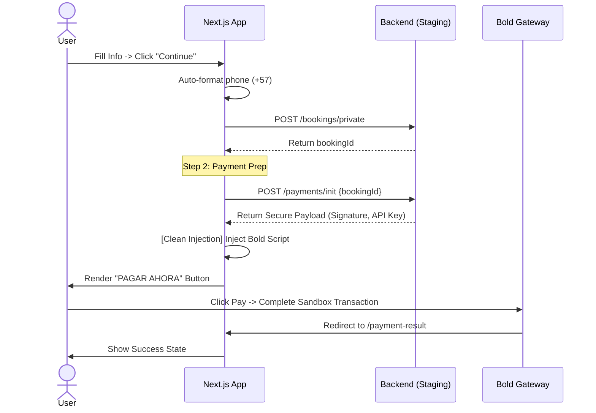

# 🔄 System Flows

## 1. Booking & Payment Sequence

## 2. Navigation Flow
- **Tour Detail:** Main conversion point.
- **Bold Checkout:** In-modal interaction (Step 2).
- **Payment Result:** Standalone landing page for transaction status confirmation.
