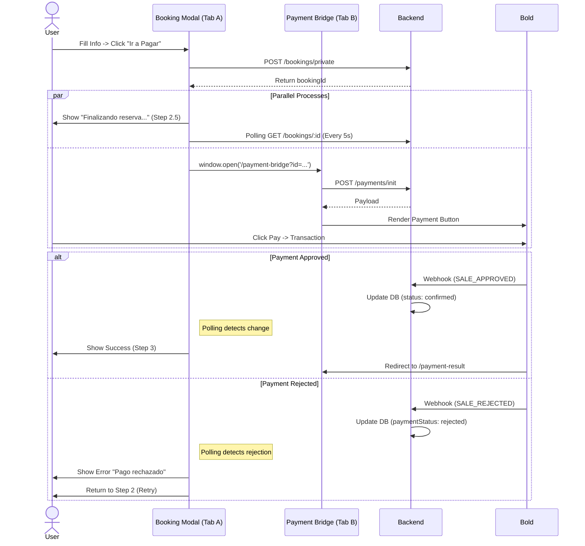

# 🔄 System Flows

## 1. Booking & Payment Sequence (Bridge Pattern)

## 2. Navigation Flow
- **Tour Detail (Modal):** Main conversion point. Maintains state via Polling.
- **Payment Bridge (`/payment-bridge`):** Dedicated tab for Bold interaction.
- **Payment Result:** Landing page for the Bridge tab (User confirmation).